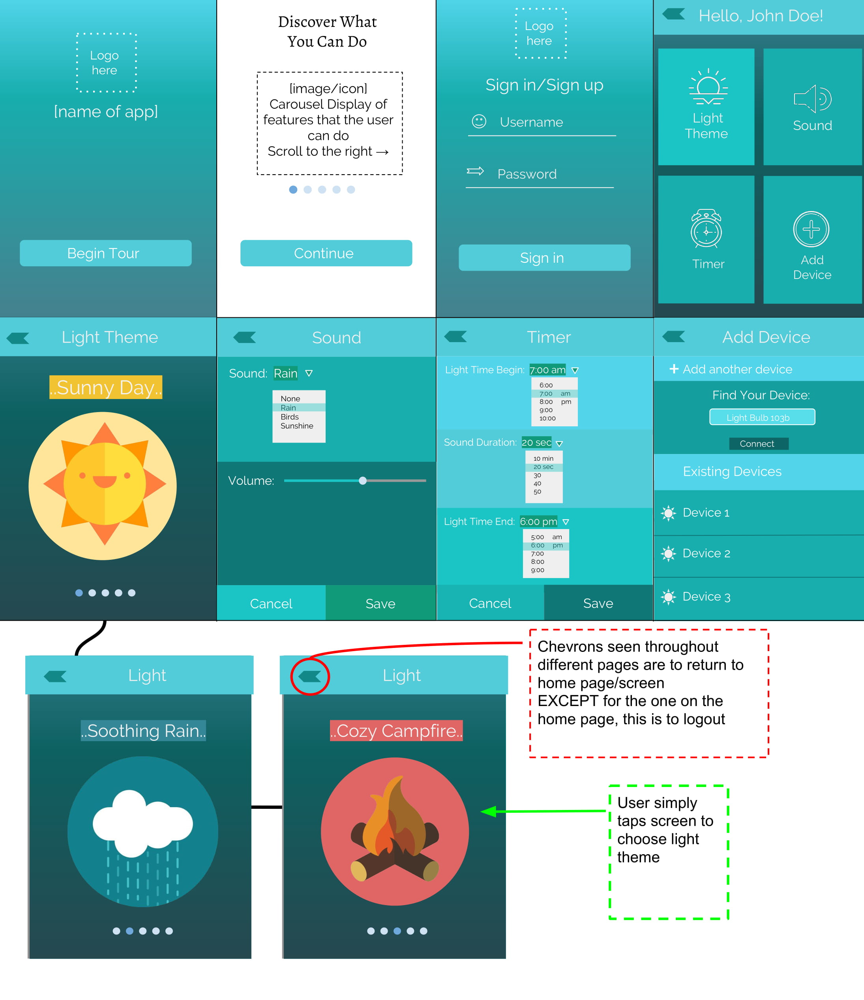

# Table of contents

* [About Project](#about-project)
* [The App](#the-app)
* [Mockup Interface](#mockup-interface)
* [Languages](#languages)

# About Project

For this class we are tasked to come up with an ambient interface to control an ambient device. The ambient device we were given is a light bulb (YeeLight) that can change from white light to day lighting. 

# The App

The goal of our app is to be able to configure the light to be able to change according to different light themes that represent weather or nature. Along with these themes there will be coordinating sounds that will be played, that the user can choose.

# Mockup Interace

# Languages

The language we plan on using to develop this app is Java.
